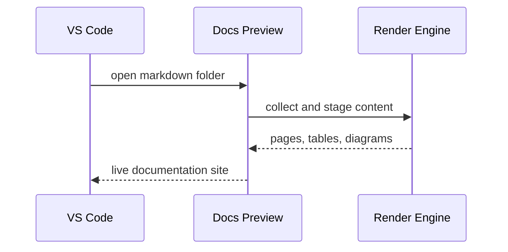
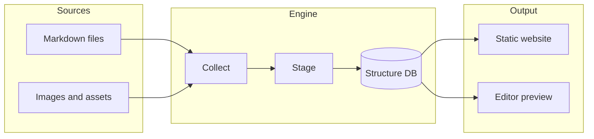
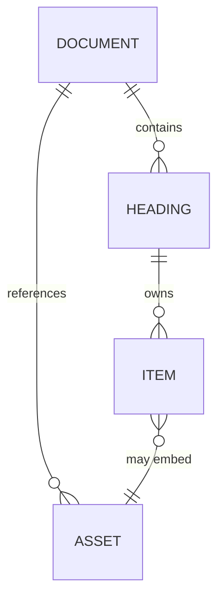
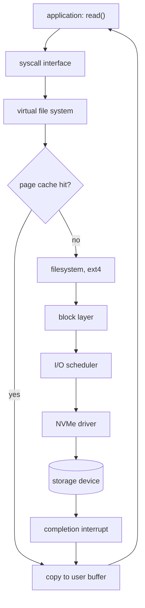
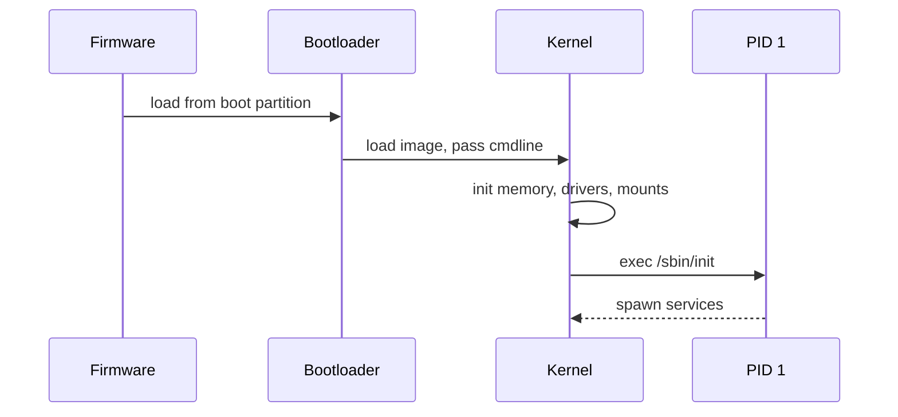
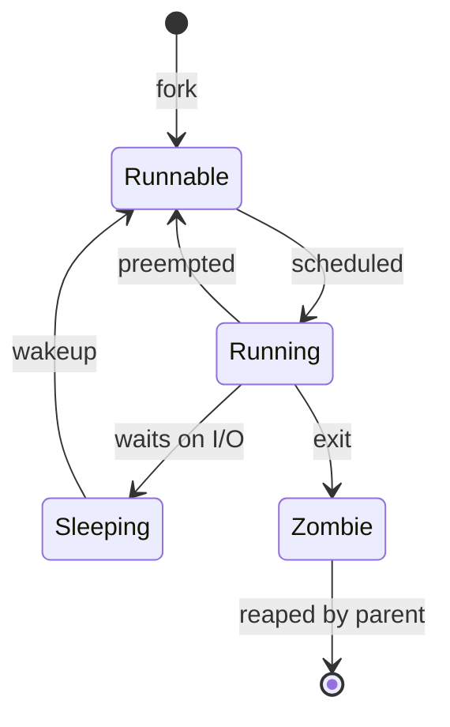
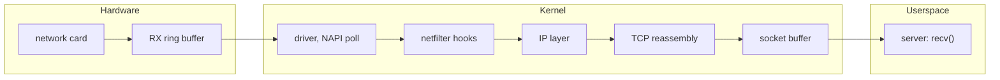
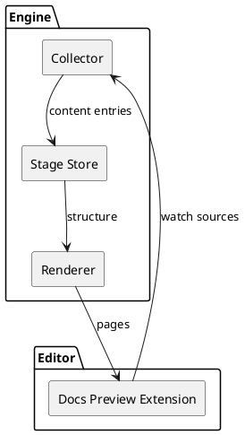

One long technical document, still navigable. The pages tree on the left mirrors
your folder structure, the outline on the right maps every section, and small
markers flag which sections contain tables and diagrams — so you can jump
straight to the content you need.

# Mermaid Diagram


## Markdown Table
| Panel | What it shows | Why it matters |
|-------|---------------|----------------|
| Pages tree | Folder structure of your Markdown sources | Navigate hundreds of files without leaving the preview |
| Outline | Headings of the current page, all levels | Jump inside long documents in one click |
| Section markers | Table and diagram indicators per section | Spot data and figures before scrolling |
| Content view | Rendered Markdown with interactive components | Panzoom diagrams, sortable tables, code highlighting |

Everything below is regular Markdown: headings, paragraphs, tables, code
blocks, and text diagrams rendered on the fly. No build step, no export — the
preview stays in sync with your files.

# Architecture

## Content Pipeline

Markdown files are collected, staged, and rendered through a single engine
that serves both the full website build and the lightweight editor preview.



| Stage | Input | Output |
|-------|-------|--------|
| Collect | Markdown, images, data files | Normalized content entries |
| Stage | Content entries | Structure database |
| Render | Structure database | HTML pages and menus |
| Serve | HTML pages | Website or live preview |

### Why One Engine

Both profiles share the same parsing, the same menus, and the same rendering
components. What you see in the editor preview is what ships on the website.

## Data Model

The structure database keeps documents, their headings, and their assets
linked together — that is what powers the outline and the section markers.



| Entity | Key fields | Used for |
|--------|-----------|----------|
| Document | url, title, sort order | Pages tree entries |
| Heading | level, slug, table and diagram flags | Outline and markers |
| Item | type, position | Section content mapping |
| Asset | uid, extension, path | Images, diagrams, data files |

# Sample Content: Inside an Operating System

Real documentation gets long. This chapter mimics a systems handbook to show
how diagrams, tables, and prose hold up at scale.

## From read() to the Disk

A single `read()` call crosses half the kernel. Twelve boxes are enough to
tell the story without turning it into a point cloud.



| Layer | Typical latency | Notes |
|-------|-----------------|-------|
| Page cache hit | ~1 µs | No device involved |
| NVMe read | ~100 µs | Queue depth dependent |
| SATA SSD read | ~500 µs | Legacy protocol overhead |
| Spinning disk | ~10 ms | Seek plus rotation |

## Boot Sequence



| Phase | Owner | Ends when |
|-------|-------|-----------|
| POST | Firmware | Boot device selected |
| Boot | Bootloader | Kernel image in memory |
| Kernel init | Kernel | Root filesystem mounted |
| Userspace | PID 1 | Login available |

## Process Lifecycle

Every task the scheduler touches is in exactly one of these states.



| State | In `ps` | Meaning |
|-------|---------|---------|
| Running | R | On a CPU right now |
| Runnable | R | Ready, waiting for a CPU |
| Sleeping | S / D | Blocked on an event or I/O |
| Zombie | Z | Exited, exit code not yet collected |

## A Packet's Journey



| Hop | Structure | Purpose |
|-----|-----------|---------|
| RX ring | `rx_ring` | DMA landing zone for frames |
| Netfilter | `nf_hook_ops` | Firewall and NAT decisions |
| TCP | `sk_buff` | Ordering, retransmission |
| Socket | `sk_receive_queue` | Hand-off to the application |

# Code Alongside Everything Else

Documentation is rarely diagrams alone. Code blocks sit between tables and
figures with full syntax highlighting.

## Inspecting Pages with Python

```python
import json
from pathlib import Path

dataset = json.loads(Path("structure.json").read_text())

for doc in dataset["documents"]:
    marks = [h for h in doc["headings"] if h.get("hasDiagram")]
    print(f"{doc['url']:40} {len(doc['headings']):3} sections, "
          f"{len(marks)} with diagrams")
```

## Shell One-Liners

```bash
# count sections and diagrams across the whole documentation
grep -rc '^#' content --include='*.md' | sort -t: -k2 -rn | head
grep -rl '```mermaid' content --include='*.md' | wc -l
```

| Command | Answers |
|---------|---------|
| `grep -c '^#'` | Which pages are the longest |
| `grep -l 'mermaid'` | Which pages carry diagrams |

## Watching Files in Rust

```rust
use notify::{recommended_watcher, RecursiveMode, Watcher};
use std::path::Path;

fn main() -> notify::Result<()> {
    let mut watcher = recommended_watcher(|event| {
        if let Ok(event) = event {
            println!("changed: {:?}", event.paths);
        }
    })?;
    watcher.watch(Path::new("content"), RecursiveMode::Recursive)?;
    std::thread::park();
    Ok(())
}
```

# Component View

The same content can also be described with PlantUML when component detail
matters more than flow.



| Component | Responsibility |
|-----------|----------------|
| Collector | Scan sources, normalize entries |
| Stage store | Persist structure between runs |
| Renderer | Produce pages, menus, outlines |
| Preview extension | Serve it all inside the editor |

# Where to Go Next

The [Examples](../examples/) section demonstrates each feature in isolation:
tables from data files, panzoom diagrams, galleries, code blocks, and more.
This page simply puts them side by side — the way real documentation does.
