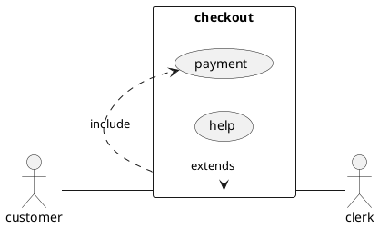
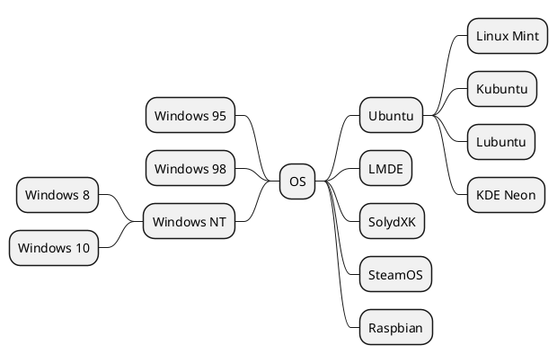
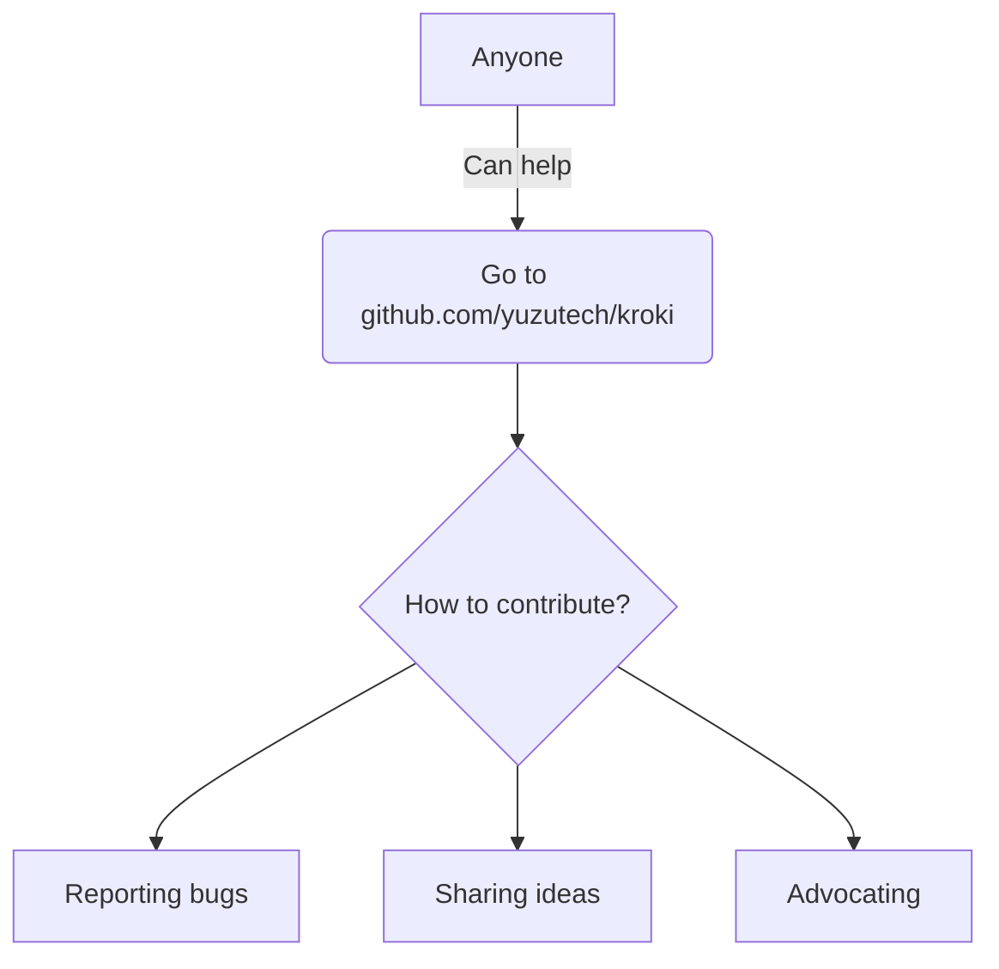

# Block Diagram

```blockdiag
blockdiag {
  Kroki -> is -> Awesome;
}
```
# Plantuml
## Sequence Diagram


## Mind Map



## Work Breakout
Diagrams can also be linked from a separate file like this

```md
[Work Breakout](./work-breakout.puml)
```
Which will generate the same view as if it was embedded in a code block

[Work Breakout](./work-breakout.puml)

# Mermaid


