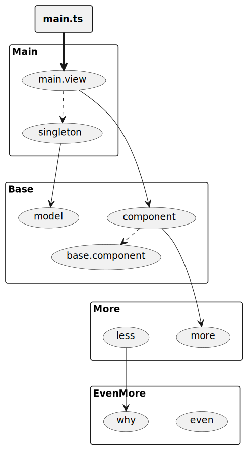

This is a link to an SVG file
```md

```

when adding a meta data yaml file `test-diag-link.yaml` with this content
```yaml
links:
  - label: component
    link: https://en.wikipedia.org/wiki/Software_component
  - label: model
    link: https://en.wikipedia.org/wiki/Model
```

Will generate an SVG diagram with links


