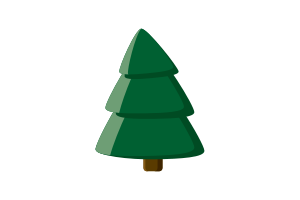
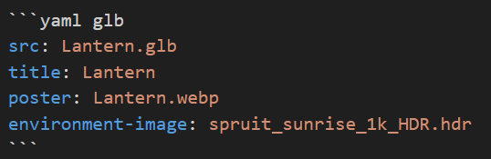
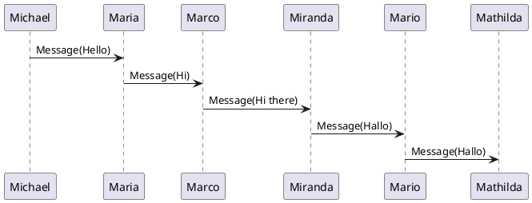

**Astro Big Doc** uses Markdown as CMS rendered with Astro components

# Images
link to [svg image](#svg-image)
## Simple Image link
Images are encapsulated inside a component that can open them in a Modal full view for Pan and zoom function

```markdown

```

will generate this image


## Advanced Image Directive
In order to give more options, using the image directive allows to pass more arguments from markdown

```markdown
:image[]{src=./home/astro-markdown-render-small.png alt="Astro Markdown Render" height=200 center}
```

will generate this image height adjusted size. Aspect ratio is conserved even when giving either of width or height. It is also possible to center the image.

:image[]{src=./home/astro-markdown-render-small.png alt="Astro Markdown Render" height=200 center}

## SVG Image




## Gallery

This is a Gallery Astro component, a yaml Code block with metadata 'gallery' is provided with a list of images like this

``````
```yaml pz_gallery
- tree.svg
- gallery-tiger.svg
- gallery-long_diag.svg
- gallery-Linux_kernel_map.svg
- gallery-tiger.svg
- github-dark.png
```
``````

will generate this gallery

```yaml pz_gallery
- home/tree.svg
- home/images/gallery-tiger.svg
- home/images/gallery-long_diag.svg
- home/images/gallery-Linux_kernel_map.svg
- home/images/gallery-tiger.svg
- home/images/github-dark.png
```

## Cards
It is also possible to create cards from a yaml code block list. The following list where uid points to an existing document of format `markdown` or `markdown_card`

``````
```yaml cards
-   uid: cards-body.card-1
    body: true
    width: 300
-   uid: cards-body.card-2
    body: true
    width: 300
```
``````

Will generate the following cards

```yaml cards
-   uid: cards-body.card-1
    body: true
    width: 300
-   uid: cards-body.card-2
    body: true
    width: 300
```


# 3D Model viewer
[Model Viewer](https://modelviewer.dev/) Makrdown plugin

models from https://modelviewer.dev/editor/

## From a link
just by inserting a link to a .glb file

```markdown
[Astronaut](./home/Astronaut.glb)
```
will generate this 3D model

[Astronaut](./home/Astronaut.glb)


## From code
This piece of code using as code language `yaml` and code meta-data : `glb` as follows




will generate this 3D model with the provided files.
* poster : allows fast page load, by loading the image only first.
* environment-image : for lighting effect

```yaml glb
src: Lantern.glb
title: Lantern
poster: home/Lantern.webp
environment-image: spruit_sunrise_1k_HDR.hdr
```


# Tables
## Markdown Simple Table

A markdown table like this one

```markdown
| Column 1 | Column 2 |
|----------|----------|
| Row 1    | Row 1 c2 |
| Row 2    | Row 2 c2 |
```

is a table that has a low number of lines and therfore gets a simple table view

| Column 1 | Column 2 |
|----------|----------|
| Row 1    | Row 1 c2 |
| Row 2    | Row 2 c2 |

## Markdown Data Table
A table with a high number of lines gets a [data-table](https://datatables.net/) element with filter and pagination

| Name   | Age | City         |
|--------|-----|--------------|
| Johnny | 36  | New York     |
| John   | 30  | New York     |
| Jane   | 28  | Los Angeles  |
| Janny  | 22  | Los Angeles  |
| Marc   | 28  | Los Angeles  |
| Marco  | 21  | Bahamas      |
| Joanna | 29  | New York     |
| Joanna | 29  | Los Angeles  |
| Alice  | 32  | Miami        |
| Bob    | 27  | Seattle      |
| Clara  | 33  | Chicago      |
| Dave   | 24  | Houston      |
| Ella   | 26  | Atlanta      |


## XLSX Table
It is also possible to create tables in xlsx format. This link of `.xlsx` extension

```markdown
[Table1](./home/Table1.xlsx)
```
will generate this data table

[Table1](./home/Table1.xlsx)

# Notes
A note can be created like this and can have markdown inside

```markdown
:::Note
## Note title
This is a note
:::
```
will produce this
:::Note
## Note title
This is a note
:::
There are multiple types : Note, Tip, Caution, Danger

it can also have a custom title
```markdown
:::Tip{title="How to solve this"}
This is very easy
:::
```

:::Tip{title="How to solve this"}
This is very easy
:::

Caution

:::Caution
Be very careful
:::

Danger

:::Danger
There is a big risk here
* The build could fail
* The error could persist
* The design could be wrong
:::

# Details
It is possible to hide details inside an open close block like this

```markdown
:::details{summary="Summary of the details..."}
Detail to hide
:::
```
Will produce this Details block

:::details{summary="Summary of the details..."}
Detail to hide
:::

# Code block

The code block offers a `copy` button visible on hover over the code.

javascript
```js
const count = 0
console.log(count)
```
python
```python
for item in my_list:
  print(item)
```


# Links
* external link Astro Markdown Render [github repo](https://github.com/MicroWebStacks/astro-markdown-render) link is external and opens in a new page.

* Link to the [Panzoom](/examples/panzoom) entry opens in the same page

# Diagrams from code
This is a concept where diagrams are generated from a code block that witholds the description needed to generate them. Note these sorts of diagrams are much more informative for automation and LLMs processing than usual bitmaps or vectorial images.

## Plantuml
This is a [plantuml](https://plantuml.com/sequence-diagram) sequence diagram



# References
## simple reference
this is how you can reference a page

```markdown
Link to page::<page-uid>
Link to page::examples.svg-panzoom
```
will produce this


Link to page::examples.svg-panzoom

## deep path reference
A slug is only unique within a content type, therefore in case of multiple files with the same folder name and title, it is possible to use the automatically generated unique identifier available in the `index.json`

```markdown
Link to page::<page-uid>
Link to page::deepest2.deepest3
```

will link the correct url of the item in path `folder/trees/image-svg/readme.md`

Link to page::deepest2.deepest3
