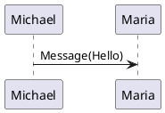

# Plantuml Static integration

## Astro Component
This is using an `Svgb` Astro component. Here the user has to provide an svg file
```jsx
<Svgb filename="file1.mdx.my-puml.svg" />
```
<Svgb filename="file1.mdx.my-puml.svg" />

## Code
This is using a `puml` code. Here the user write a plantuml sequence on the markdown code tag, astro will replace it on build time with an svg using a remark plugin.

```
@startuml
Michael -> Maria : Message(Hello)
@enduml
```



After the code