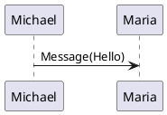
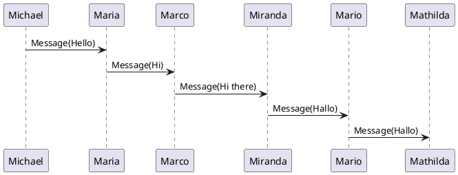

# Plantuml Static integrations
These integrations use a markdown code block with specific languages
```
@startuml
Michael -> Maria : Message(Hello)
@enduml
```

## Remark Plantuml Astro Component
This code is using `plantuml` code. The remark plugin associated with it is `remark-plantuml-astro` it generates an svg file out of the sequence and only passes a `<data.../>` tag that will be replaced by an `SvgPz` astro component, which can enhance it with features like modal pan zoom or more.



## Remark Plantuml Svg
This code is using `plantumlsvg` code. The remark plugin associated with it is `remark-plantuml-svg`, it directly replaces the code block with an svg content.

```plantumlsvg my-puml
@startuml
Michael -> Maria : Message(Hello)
@enduml
```

## Long sequence


