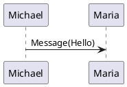

# Plantuml Static integrations

## Plantuml Code Rehype plugin
This is using a `puml` code. Here the user write a plantuml sequence on the markdown code tag, astro will replace it on build time with an svg using a remark plugin.

```
@startuml
Michael -> Maria : Message(Hello)
@enduml
```



## Svg Astro Component
This is using an `SvgPz` Astro component. Here the user has to provide an svg file name that is in the same markdown file directory
```jsx
<SvgPz data-filename="file1.mdx.my-puml.svg" />
```
<SvgPz data-filename="file1.mdx.my-puml.svg" />
