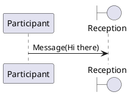

# Plantuml Dynamic loading
Loaded dynamically from the plantuml server. Some latecy is observed.

## Sequence

```plantuml
@startuml
participant Participant as Foo
boundary    Reception    as Foo1
Foo -> Foo1 : Message(Hi there)
@enduml
```
