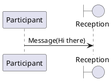

# Plantuml Markdown integrations

## static sequence
This sequence is using `remark-plantuml-svg` which replaces the code with svg on build time




## dynamic sequence
This sequence is using `remark-plantuml-object` which only encodes the sequence and place it on an `object` that is fetched on load from the client. Some latecy can be observed on first load.

```plantumldyn
@startuml
participant Participant as Foo
boundary    Reception    as Foo1
Foo -> Foo1 : Message(Hi there)
@enduml
```

<SvgPz data-filename="tree.svg" />
