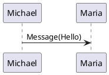

import Hamburger from "../svg/hamburger.astro"

# Title 1

This is an astro Hamburger component
<Hamburger />

and this is a plantuml sequence generated from a code section

```plantuml my-puml-1
@startuml
Michael -> Maria : Message(Hello)
@enduml
```
